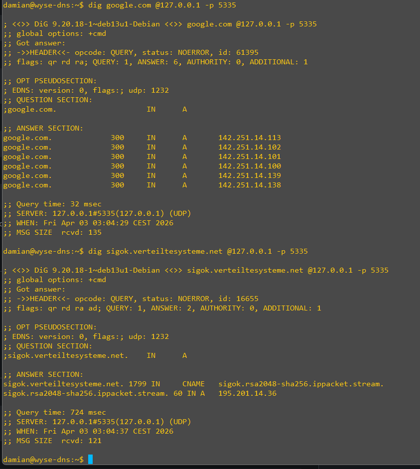
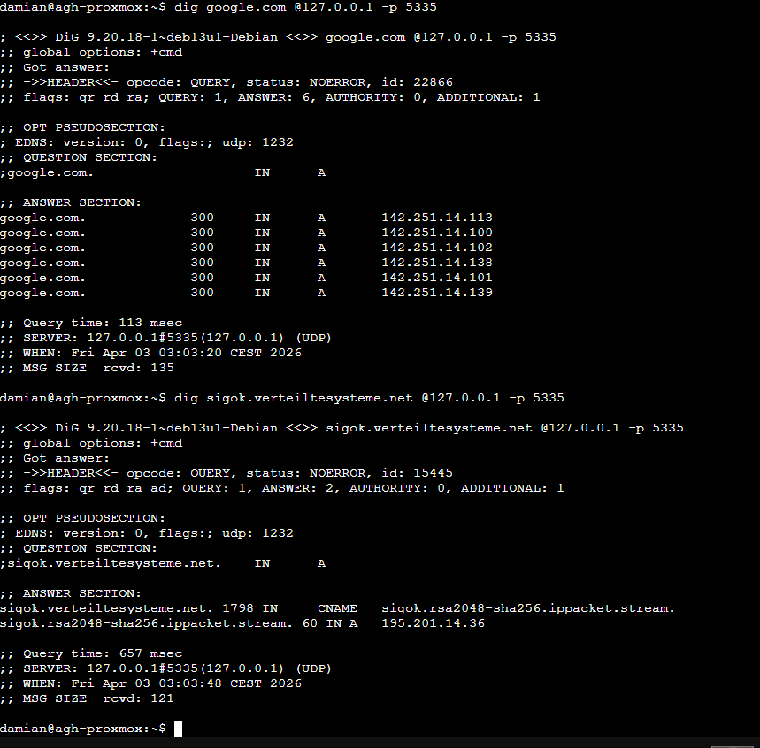

# Unbound — Instalacja i konfiguracja | Installation and Configuration | Installation und Konfiguration

> 🇵🇱 [Polski](#-polski) | 🇬🇧 [English](#-english) | 🇩🇪 [Deutsch](#-deutsch)

> [Proof of Concept](#-proof-of-concept)

---

# 🇵🇱 Polski

> 🇵🇱 [Polski](#-polski) | 🇬🇧 [English](#-english) | 🇩🇪 [Deutsch](#-deutsch)

> **Środowisko:** Debian 13.3  
> **Cel:** Instalacja Unbound jako lokalnego DNS resolvera działającego pod AdGuard Home  
> **Dotyczy:**
> - 🖥️ **Wyse** — DELL Wyse 3040 (Intel Atom, 2GB RAM, 16GB eMMC) — główna instancja AGH
> - 📦 **LXC** — LXC Debian na Proxmox Node 1 (1GB RAM, 6GB storage) — replika AGH

## Spis treści

1. [Koncepcja](#1-koncepcja)
2. [Instalacja Unbound](#2-instalacja-unbound)
3. [Root Hints](#3-root-hints)
4. [Root Key (DNSSEC)](#4-root-key-dnssec)
5. [Konfiguracja](#5-konfiguracja)
6. [Uruchomienie i weryfikacja](#6-uruchomienie-i-weryfikacja)
7. [Konfiguracja AdGuard Home](#7-konfiguracja-adguard-home)
8. [Odświeżanie Root Hints](#8-odświeżanie-root-hints)

## 1. Koncepcja

Domyślnie AdGuard Home wysyła zapytania DNS do zewnętrznych resolverów (np. `8.8.8.8`, `1.1.1.1`). Oznacza to, że dostawca resolvera widzi Twoje zapytania.

Unbound rozwiązuje ten problem działając jako **rekurencyjny resolver** — sam odpytuje kolejno serwery root, TLD i autorytatywne, bez udziału pośredników. AGH nadal blokuje reklamy i trackery, ale zapytania które go przejdą trafiają do Unbounda zamiast do zewnętrznego DNS.

```
Klient → AdGuard Home (blokowanie) → Unbound (127.0.0.1:5335) → Root Servers → ...
```

## 2. Instalacja Unbound

```bash
apt update && apt install unbound -y
```

Sprawdź czy usługa się uruchomiła:

```bash
systemctl status unbound
```

> ℹ️ Na tym etapie Unbound może zgłaszać błędy konfiguracji — to normalne, domyślny plik konfiguracyjny zostanie zastąpiony w kolejnych krokach.

## 3. Root Hints

Root hints to lista adresów głównych serwerów DNS. Unbound używa ich jako punktu startowego do rekurencyjnego rozwiązywania zapytań. Plik wymaga odświeżania co kilka miesięcy.

```bash
curl -o /var/lib/unbound/root.hints https://www.internic.net/domain/named.root
```

Sprawdź czy plik istnieje:

```bash
ls -la /var/lib/unbound/root.hints
```

## 4. Root Key (DNSSEC)

Plik `root.key` zawiera główny trust anchor DNSSEC. Unbound aktualizuje go automatycznie przy każdym starcie gdy dyrektywa `auto-trust-anchor-file` jest ustawiona.

Sprawdź czy plik już istnieje:

```bash
ls -la /var/lib/unbound/root.key
```

Jeśli nie istnieje, wygeneruj go:

```bash
unbound-anchor -a /var/lib/unbound/root.key
```

> ⚠️ Kod wyjścia `1` przy pierwszym uruchomieniu jest **normalny** — oznacza świeże pobranie klucza.

Ustaw właściciela pliku:

```bash
chown unbound:unbound /var/lib/unbound/root.key
```

Oczekiwane uprawnienia:
```
-rw-r--r-- 1 unbound unbound 1248 ... /var/lib/unbound/root.key
```

> ℹ️ Unbound potrzebuje dostępu do **zapisu** żeby aktualizować klucz. Jeśli odtwarzasz plik z backupu — zawsze sprawdź właściciela przez `chown unbound:unbound`.

## 5. Konfiguracja

Utwórz plik konfiguracyjny:

```bash
nano /etc/unbound/unbound.conf.d/adguard.conf
```

> ⚠️ **Uwaga dla Debian 13:** Debian automatycznie tworzy plik `/etc/unbound/unbound.conf.d/root-auto-trust-anchor-file.conf` który już zawiera dyrektywę `auto-trust-anchor-file`. Nie dodawaj jej w swoim pliku — spowoduje błąd `trust anchor for '.' presented twice` i Unbound odmówi startu. Sprawdź przed restartem: `grep -r "auto-trust-anchor" /etc/unbound/`

### 🖥️ Wyse (2GB RAM)

```conf
server:
    # --- Nasłuch i podstawy ---
    verbosity: 0
    interface: 127.0.0.1
    port: 5335
    do-ip4: yes
    do-udp: yes
    do-tcp: yes
    do-ip6: no
    prefer-ip6: no

    # --- Root Hints ---
    root-hints: "/var/lib/unbound/root.hints"

    # --- Bezpieczeństwo i ukrywanie tożsamości ---
    hide-identity: yes
    hide-version: yes

    # --- Zabezpieczenia DNSSEC ---
    harden-glue: yes
    harden-dnssec-stripped: yes
    harden-referral-path: yes
    unwanted-reply-threshold: 10000
    use-caps-for-id: yes

    # --- Prefetching ---
    prefetch: yes
    prefetch-key: yes

    # --- Tuning wydajności (Intel Atom, 2GB RAM) ---
    num-threads: 1
    edns-buffer-size: 1232

    # --- Cache ---
    msg-cache-size: 32m
    rrset-cache-size: 64m
    neg-cache-size: 8m

    # --- Ochrona przed DNS Rebinding ---
    private-address: 192.168.0.0/16
    private-address: 169.254.0.0/16
    private-address: 172.16.0.0/12
    private-address: 10.0.0.0/8
    private-address: fd00::/8
    private-address: fe80::/10

    # --- Kontrola dostępu ---
    access-control: 127.0.0.0/8 allow
```

### 📦 LXC (1GB RAM)

```conf
server:
    # --- Nasłuch i podstawy ---
    verbosity: 0
    interface: 127.0.0.1
    port: 5335
    do-ip4: yes
    do-udp: yes
    do-tcp: yes
    do-ip6: no
    prefer-ip6: no

    # --- Root Hints ---
    root-hints: "/var/lib/unbound/root.hints"

    # --- Bezpieczeństwo i ukrywanie tożsamości ---
    hide-identity: yes
    hide-version: yes

    # --- Zabezpieczenia DNSSEC ---
    harden-glue: yes
    harden-dnssec-stripped: yes
    harden-referral-path: yes
    unwanted-reply-threshold: 10000
    use-caps-for-id: yes

    # --- Prefetching ---
    prefetch: yes
    prefetch-key: yes

    # --- Tuning wydajności (LXC, 1GB RAM) ---
    num-threads: 1
    edns-buffer-size: 1232

    # --- Cache (zachowawczy) ---
    msg-cache-size: 16m
    rrset-cache-size: 32m
    neg-cache-size: 4m

    # --- Ochrona przed DNS Rebinding ---
    private-address: 192.168.0.0/16
    private-address: 169.254.0.0/16
    private-address: 172.16.0.0/12
    private-address: 10.0.0.0/8
    private-address: fd00::/8
    private-address: fe80::/10

    # --- Kontrola dostępu ---
    access-control: 127.0.0.0/8 allow
```

## 6. Uruchomienie i weryfikacja

Przed restartem zawsze sprawdź składnię:

```bash
sudo unbound-checkconf
```

Powinno zwrócić:
```
unbound-checkconf: no errors in /etc/unbound/unbound.conf
```

Zrestartuj Unbound:

```bash
sudo systemctl restart unbound
sudo systemctl status unbound
```

Test podstawowy:
```bash
dig google.com @127.0.0.1 -p 5335
```

Test DNSSEC (flaga `ad` w odpowiedzi = DNSSEC działa):
```bash
dig sigok.verteiltesysteme.net @127.0.0.1 -p 5335
```

> ℹ️ **Znany warning:** `subnetcache: prefetch is set but not working` — można zignorować. Debian nie kompiluje domyślnie modułu subnet cache, `prefetch` działa normalnie.

## 7. Konfiguracja AdGuard Home

1. Panel AGH → **Ustawienia** → **Ustawienia DNS**
2. **Upstream DNS servers:** `127.0.0.1:5335`
3. Usuń wszystkie inne upstream serwery
4. Kliknij **Testuj upstreams** → powinno zwrócić `OK`
5. Zapisz

## 8. Odświeżanie Root Hints

Ręcznie (co kilka miesięcy):
```bash
curl -o /var/lib/unbound/root.hints https://www.internic.net/domain/named.root
sudo systemctl restart unbound
```

Automatycznie przez cron (co kwartał):
```bash
crontab -e
```
```
0 3 1 */3 * curl -o /var/lib/unbound/root.hints https://www.internic.net/domain/named.root && systemctl restart unbound
```

---

# 🇬🇧 English

> 🇵🇱 [Polski](#-polski) | 🇬🇧 [English](#-english) | 🇩🇪 [Deutsch](#-deutsch)

> **Environment:** Debian 13.3  
> **Goal:** Install Unbound as a local DNS resolver behind AdGuard Home  
> **Applies to:**
> - 🖥️ **Wyse** — DELL Wyse 3040 (Intel Atom, 2GB RAM, 16GB eMMC) — primary AGH instance
> - 📦 **LXC** — Debian LXC on Proxmox Node 1 (1GB RAM, 6GB storage) — AGH replica

## Table of Contents

1. [Concept](#1-concept)
2. [Installing Unbound](#2-installing-unbound)
3. [Root Hints](#3-root-hints-1)
4. [Root Key (DNSSEC)](#4-root-key-dnssec-1)
5. [Configuration](#5-configuration)
6. [Starting and Verifying](#6-starting-and-verifying)
7. [AdGuard Home Configuration](#7-adguard-home-configuration)
8. [Refreshing Root Hints](#8-refreshing-root-hints)

## 1. Concept

By default, AdGuard Home forwards DNS queries to external resolvers (e.g. `8.8.8.8`, `1.1.1.1`), meaning the resolver provider can see your queries.

Unbound solves this by acting as a **recursive resolver** — it queries root servers, TLD servers, and authoritative servers directly, with no third-party intermediaries. AGH still blocks ads and trackers, but queries that pass through go to Unbound instead of an external DNS.

```
Client → AdGuard Home (blocking) → Unbound (127.0.0.1:5335) → Root Servers → ...
```

## 2. Installing Unbound

```bash
apt update && apt install unbound -y
```

Check if the service started:

```bash
systemctl status unbound
```

> ℹ️ Unbound may report configuration errors at this stage — this is expected. The default config will be replaced in the next steps.

## 3. Root Hints

Root hints is a list of DNS root server addresses. Unbound uses them as the starting point for recursive resolution. Refresh the file every few months.

```bash
curl -o /var/lib/unbound/root.hints https://www.internic.net/domain/named.root
```

Verify the file exists:

```bash
ls -la /var/lib/unbound/root.hints
```

## 4. Root Key (DNSSEC)

The `root.key` file contains the DNSSEC trust anchor. Unbound updates it automatically on each start when `auto-trust-anchor-file` is set.

Check if it already exists:

```bash
ls -la /var/lib/unbound/root.key
```

If it doesn't exist, generate it:

```bash
unbound-anchor -a /var/lib/unbound/root.key
```

> ⚠️ Exit code `1` on first run is **normal** — the key was freshly downloaded, not updated.

Set the correct owner:

```bash
chown unbound:unbound /var/lib/unbound/root.key
```

Expected permissions:
```
-rw-r--r-- 1 unbound unbound 1248 ... /var/lib/unbound/root.key
```

> ℹ️ Unbound needs **write access** to update the key. If you restore from backup, always verify ownership with `chown unbound:unbound`.

## 5. Configuration

Create the configuration file:

```bash
nano /etc/unbound/unbound.conf.d/adguard.conf
```

> ⚠️ **Debian 13 note:** Debian automatically creates `/etc/unbound/unbound.conf.d/root-auto-trust-anchor-file.conf` which already contains the `auto-trust-anchor-file` directive. Do not add it in your own file — it will cause a `trust anchor for '.' presented twice` error and Unbound will refuse to start. Check before restarting: `grep -r "auto-trust-anchor" /etc/unbound/`

### 🖥️ Wyse (2GB RAM)

```conf
server:
    # --- Listen and basics ---
    verbosity: 0
    interface: 127.0.0.1
    port: 5335
    do-ip4: yes
    do-udp: yes
    do-tcp: yes
    do-ip6: no
    prefer-ip6: no

    # --- Root Hints ---
    root-hints: "/var/lib/unbound/root.hints"

    # --- Security and identity hiding ---
    hide-identity: yes
    hide-version: yes

    # --- DNSSEC hardening ---
    harden-glue: yes
    harden-dnssec-stripped: yes
    harden-referral-path: yes
    unwanted-reply-threshold: 10000
    use-caps-for-id: yes

    # --- Prefetching ---
    prefetch: yes
    prefetch-key: yes

    # --- Performance tuning (Intel Atom, 2GB RAM) ---
    num-threads: 1
    edns-buffer-size: 1232

    # --- Cache ---
    msg-cache-size: 32m
    rrset-cache-size: 64m
    neg-cache-size: 8m

    # --- DNS Rebinding protection ---
    private-address: 192.168.0.0/16
    private-address: 169.254.0.0/16
    private-address: 172.16.0.0/12
    private-address: 10.0.0.0/8
    private-address: fd00::/8
    private-address: fe80::/10

    # --- Access control ---
    access-control: 127.0.0.0/8 allow
```

### 📦 LXC (1GB RAM)

```conf
server:
    # --- Listen and basics ---
    verbosity: 0
    interface: 127.0.0.1
    port: 5335
    do-ip4: yes
    do-udp: yes
    do-tcp: yes
    do-ip6: no
    prefer-ip6: no

    # --- Root Hints ---
    root-hints: "/var/lib/unbound/root.hints"

    # --- Security and identity hiding ---
    hide-identity: yes
    hide-version: yes

    # --- DNSSEC hardening ---
    harden-glue: yes
    harden-dnssec-stripped: yes
    harden-referral-path: yes
    unwanted-reply-threshold: 10000
    use-caps-for-id: yes

    # --- Prefetching ---
    prefetch: yes
    prefetch-key: yes

    # --- Performance tuning (LXC, 1GB RAM) ---
    num-threads: 1
    edns-buffer-size: 1232

    # --- Cache (conservative) ---
    msg-cache-size: 16m
    rrset-cache-size: 32m
    neg-cache-size: 4m

    # --- DNS Rebinding protection ---
    private-address: 192.168.0.0/16
    private-address: 169.254.0.0/16
    private-address: 172.16.0.0/12
    private-address: 10.0.0.0/8
    private-address: fd00::/8
    private-address: fe80::/10

    # --- Access control ---
    access-control: 127.0.0.0/8 allow
```

## 6. Starting and Verifying

Always check config syntax before restarting:

```bash
sudo unbound-checkconf
```

Should return:
```
unbound-checkconf: no errors in /etc/unbound/unbound.conf
```

Restart Unbound:

```bash
sudo systemctl restart unbound
sudo systemctl status unbound
```

Basic test:
```bash
dig google.com @127.0.0.1 -p 5335
```

DNSSEC test (`ad` flag in response = DNSSEC working):
```bash
dig sigok.verteiltesysteme.net @127.0.0.1 -p 5335
```

> ℹ️ **Known warning:** `subnetcache: prefetch is set but not working` — can be ignored. Debian does not compile the subnet cache module by default; prefetch works normally.

## 7. AdGuard Home Configuration

1. AGH panel → **Settings** → **DNS settings**
2. **Upstream DNS servers:** `127.0.0.1:5335`
3. Remove all other upstream servers
4. Click **Test upstreams** → should return `OK`
5. Save

## 8. Refreshing Root Hints

Manually (every few months):
```bash
curl -o /var/lib/unbound/root.hints https://www.internic.net/domain/named.root
sudo systemctl restart unbound
```

Automatically via cron (quarterly):
```bash
crontab -e
```
```
0 3 1 */3 * curl -o /var/lib/unbound/root.hints https://www.internic.net/domain/named.root && systemctl restart unbound
```

---

# 🇩🇪 Deutsch

> 🇵🇱 [Polski](#-polski) | 🇬🇧 [English](#-english) | 🇩🇪 [Deutsch](#-deutsch)

> **Umgebung:** Debian 13.3  
> **Ziel:** Installation von Unbound als lokaler DNS-Resolver hinter AdGuard Home  
> **Betrifft:**
> - 🖥️ **Wyse** — DELL Wyse 3040 (Intel Atom, 2GB RAM, 16GB eMMC) — primäre AGH-Instanz
> - 📦 **LXC** — Debian LXC auf Proxmox Node 1 (1GB RAM, 6GB Storage) — AGH-Replik

## Inhaltsverzeichnis

1. [Konzept](#1-konzept)
2. [Unbound installieren](#2-unbound-installieren)
3. [Root Hints](#3-root-hints-2)
4. [Root Key (DNSSEC)](#4-root-key-dnssec-2)
5. [Konfiguration](#5-konfiguration)
6. [Starten und Überprüfen](#6-starten-und-überprüfen)
7. [AdGuard Home konfigurieren](#7-adguard-home-konfigurieren)
8. [Root Hints aktualisieren](#8-root-hints-aktualisieren)

## 1. Konzept

Standardmäßig leitet AdGuard Home DNS-Anfragen an externe Resolver weiter (z.B. `8.8.8.8`, `1.1.1.1`), wodurch der Resolver-Anbieter alle Anfragen sehen kann.

Unbound löst dieses Problem, indem es als **rekursiver Resolver** agiert — es befragt Root-Server, TLD-Server und autoritative Server direkt, ohne Drittanbieter. AGH blockiert weiterhin Werbung und Tracker, aber Anfragen die AGH passieren, gehen an Unbound statt an einen externen DNS.

```
Client → AdGuard Home (Blockierung) → Unbound (127.0.0.1:5335) → Root Server → ...
```

## 2. Unbound installieren

```bash
apt update && apt install unbound -y
```

Status des Dienstes prüfen:

```bash
systemctl status unbound
```

> ℹ️ Unbound kann in dieser Phase Konfigurationsfehler melden — das ist normal. Die Standardkonfiguration wird in den nächsten Schritten ersetzt.

## 3. Root Hints

Root Hints ist eine Liste der DNS-Root-Server-Adressen. Unbound verwendet sie als Ausgangspunkt für die rekursive Auflösung. Die Datei sollte alle paar Monate aktualisiert werden.

```bash
curl -o /var/lib/unbound/root.hints https://www.internic.net/domain/named.root
```

Datei überprüfen:

```bash
ls -la /var/lib/unbound/root.hints
```

## 4. Root Key (DNSSEC)

Die Datei `root.key` enthält den DNSSEC Trust Anchor. Unbound aktualisiert sie automatisch beim Start wenn `auto-trust-anchor-file` gesetzt ist.

Prüfen ob die Datei bereits existiert:

```bash
ls -la /var/lib/unbound/root.key
```

Falls nicht vorhanden, generieren:

```bash
unbound-anchor -a /var/lib/unbound/root.key
```

> ⚠️ Exit-Code `1` beim ersten Ausführen ist **normal** — der Schlüssel wurde neu heruntergeladen, nicht aktualisiert.

Eigentümer setzen:

```bash
chown unbound:unbound /var/lib/unbound/root.key
```

Erwartete Berechtigungen:
```
-rw-r--r-- 1 unbound unbound 1248 ... /var/lib/unbound/root.key
```

> ℹ️ Unbound benötigt **Schreibzugriff** um den Schlüssel zu aktualisieren. Bei Wiederherstellung aus einem Backup immer den Eigentümer mit `chown unbound:unbound` prüfen.

## 5. Konfiguration

Konfigurationsdatei erstellen:

```bash
nano /etc/unbound/unbound.conf.d/adguard.conf
```

> ⚠️ **Hinweis für Debian 13:** Debian erstellt automatisch `/etc/unbound/unbound.conf.d/root-auto-trust-anchor-file.conf`, das bereits die Direktive `auto-trust-anchor-file` enthält. Diese darf nicht erneut in der eigenen Konfigurationsdatei gesetzt werden — sonst erscheint der Fehler `trust anchor for '.' presented twice` und Unbound startet nicht. Vor dem Neustart prüfen: `grep -r "auto-trust-anchor" /etc/unbound/`

### 🖥️ Wyse (2GB RAM)

```conf
server:
    # --- Lauschen und Grundlagen ---
    verbosity: 0
    interface: 127.0.0.1
    port: 5335
    do-ip4: yes
    do-udp: yes
    do-tcp: yes
    do-ip6: no
    prefer-ip6: no

    # --- Root Hints ---
    root-hints: "/var/lib/unbound/root.hints"

    # --- Sicherheit und Identitätsschutz ---
    hide-identity: yes
    hide-version: yes

    # --- DNSSEC-Härtung ---
    harden-glue: yes
    harden-dnssec-stripped: yes
    harden-referral-path: yes
    unwanted-reply-threshold: 10000
    use-caps-for-id: yes

    # --- Prefetching ---
    prefetch: yes
    prefetch-key: yes

    # --- Performance-Tuning (Intel Atom, 2GB RAM) ---
    num-threads: 1
    edns-buffer-size: 1232

    # --- Cache ---
    msg-cache-size: 32m
    rrset-cache-size: 64m
    neg-cache-size: 8m

    # --- DNS-Rebinding-Schutz ---
    private-address: 192.168.0.0/16
    private-address: 169.254.0.0/16
    private-address: 172.16.0.0/12
    private-address: 10.0.0.0/8
    private-address: fd00::/8
    private-address: fe80::/10

    # --- Zugriffskontrolle ---
    access-control: 127.0.0.0/8 allow
```

### 📦 LXC (1GB RAM)

```conf
server:
    # --- Lauschen und Grundlagen ---
    verbosity: 0
    interface: 127.0.0.1
    port: 5335
    do-ip4: yes
    do-udp: yes
    do-tcp: yes
    do-ip6: no
    prefer-ip6: no

    # --- Root Hints ---
    root-hints: "/var/lib/unbound/root.hints"

    # --- Sicherheit und Identitätsschutz ---
    hide-identity: yes
    hide-version: yes

    # --- DNSSEC-Härtung ---
    harden-glue: yes
    harden-dnssec-stripped: yes
    harden-referral-path: yes
    unwanted-reply-threshold: 10000
    use-caps-for-id: yes

    # --- Prefetching ---
    prefetch: yes
    prefetch-key: yes

    # --- Performance-Tuning (LXC, 1GB RAM) ---
    num-threads: 1
    edns-buffer-size: 1232

    # --- Cache (konservativ) ---
    msg-cache-size: 16m
    rrset-cache-size: 32m
    neg-cache-size: 4m

    # --- DNS-Rebinding-Schutz ---
    private-address: 192.168.0.0/16
    private-address: 169.254.0.0/16
    private-address: 172.16.0.0/12
    private-address: 10.0.0.0/8
    private-address: fd00::/8
    private-address: fe80::/10

    # --- Zugriffskontrolle ---
    access-control: 127.0.0.0/8 allow
```

## 6. Starten und Überprüfen

Vor dem Neustart immer die Konfigurationssyntax prüfen:

```bash
sudo unbound-checkconf
```

Sollte zurückgeben:
```
unbound-checkconf: no errors in /etc/unbound/unbound.conf
```

Unbound neustarten:

```bash
sudo systemctl restart unbound
sudo systemctl status unbound
```

Grundlegender Test:
```bash
dig google.com @127.0.0.1 -p 5335
```

DNSSEC-Test (`ad`-Flag in der Antwort = DNSSEC funktioniert):
```bash
dig sigok.verteiltesysteme.net @127.0.0.1 -p 5335
```

> ℹ️ **Bekannte Warnung:** `subnetcache: prefetch is set but not working` — kann ignoriert werden. Debian kompiliert das Subnet-Cache-Modul standardmäßig nicht; Prefetch funktioniert normal.

## 7. AdGuard Home konfigurieren

1. AGH-Panel → **Einstellungen** → **DNS-Einstellungen**
2. **Upstream-DNS-Server:** `127.0.0.1:5335`
3. Alle anderen Upstream-Server entfernen
4. **Upstreams testen** klicken → sollte `OK` zurückgeben
5. Speichern

## 8. Root Hints aktualisieren

Manuell (alle paar Monate):
```bash
curl -o /var/lib/unbound/root.hints https://www.internic.net/domain/named.root
sudo systemctl restart unbound
```

Automatisch per Cron (vierteljährlich):
```bash
crontab -e
```
```
0 3 1 */3 * curl -o /var/lib/unbound/root.hints https://www.internic.net/domain/named.root && systemctl restart unbound
```

---

| | 🖥️ Wyse 3040 | 📦 LXC Proxmox |
|---|---|---|
| RAM | 2GB | 1GB |
| `msg-cache-size` | 32m | 16m |
| `rrset-cache-size` | 64m | 32m |
| `neg-cache-size` | 8m | 4m |
| AGH-Rolle / AGH role / Rola AGH | Główna / Primary / Primär | Replika / Replica / Replik |

---

*Dokumentacja / Documentation / Dokumentation — kwiecień / April 2026*

---

### Proof of Concept


