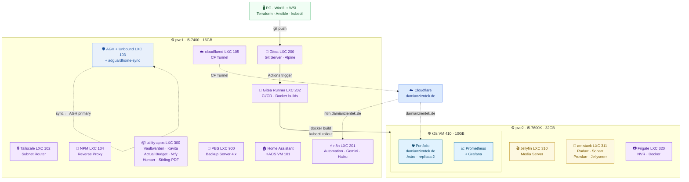

# Homelab maps

## Network topology

```mermaid
flowchart TD
    INET["🌐 Internet / Vodafone"]
    ISP_RT["📦 Router ISP\nDouble NAT"]
    CF["☁️ Cloudflare\ndamianzientek.de"]
    INET --> ISP_RT
    INET -. "DNS/Proxy" .-> CF

    FGT["🛡️ Fortigate 60E\nFirewall / Router / VLAN"]
    ISP_RT --> FGT

    NETGEAR["🔀 Netgear GS308E\nVLAN10 · VLAN100"]
    TPLINK["🔀 TP-Link TL-SG108PE\nVLAN20 · VLAN90 · PoE"]
    FGT -- "P1 VLAN10·100" --> NETGEAR
    FGT -- "P2 VLAN20·90" --> TPLINK

    WYSE["💻 DELL Wyse 3040\nDebian 13 · 10.100.30.2\nCorosync QDevice"]
    AGH1["🛡️ AdGuard Home\nGłówna instancja"]
    UB1["🔍 Unbound\nResolver"]
    KUMA["📊 Uptime Kuma"]
    FGT -- "P3 Internal3" --> WYSE
    WYSE --> AGH1 & UB1 & KUMA
    AGH1 --> UB1

    AP1["📡 FortiAP 231F\nIndoor · VLAN40·50·90"]
    AP2["📡 FortiAP U323EV-E\nOutdoor · VLAN40·50·90"]
    FGT -- "P7 PoE" --> AP1
    TPLINK -- "P4 PoE" --> AP2

    PC["🖥️ PC · Win11 + WSL\nVLAN10 HOME"]
    LAPTOP["💻 Laptop · Debian 13\nWLAN HOME"]
    SAT["📺 Dekoder SAT\nVLAN100"]
    PS5["🎮 PS5 · VLAN100"]
    NETGEAR --> PC & SAT & PS5
    AP1 -. "WiFi VLAN40" .-> LAPTOP

    CAM1["📷 Reolink RLC-510A\nKamera 1 · VLAN90"]
    CAM2["📷 Reolink RLC-510A\nKamera 2 · VLAN90"]
    SHELLY["🔌 Shelly IoT\nPro 3EM · 1PM · VLAN90"]
    PV["☀️ Balkonkraftwerk\n2×430W + 800W"]
    TPLINK -- "P1 PoE" --> CAM1
    TPLINK -- "P2 PoE" --> CAM2
    AP1 -. "WiFi VLAN90" .-> SHELLY
    SHELLY --> PV

    PVE1["⚙️ pve1 · 10.100.20.10\ni5-7400 · 16GB"]
    PVE2["⚙️ pve2 · 10.100.20.11\ni5-7600K · 32GB"]
    TPLINK -- "P7 VLAN20" --> PVE1
    TPLINK -- "P6 VLAN20" --> PVE2

    PVE1 <-. "Corosync HA\n3 votes · quorum:2" .-> PVE2
    WYSE -. "QDevice" .-> PVE1
    WYSE -. "QDevice" .-> PVE2

    PC == "DNS query" ==> FGT
    FGT == "primary DNS" ==> AGH1
    AGH1 == "upstream" ==> UB1
    FGT == "fallback DNS" ==> AGH2
    AGH2["🛡️ AGH pve1\nInstancja 2"]
    AGH1 -. "agh-sync" .-> AGH2

    classDef firewall    fill:#fdecea,stroke:#c0392b,color:#7a1e15
    classDef server      fill:#fff0d9,stroke:#e57e00,color:#8a4c00
    classDef dns         fill:#e8f0fb,stroke:#3b7dd8,color:#1a4f9c
    classDef iot         fill:#fef9c3,stroke:#ca8a04,color:#713f12
    classDef wan         fill:#f5f5f5,stroke:#888,color:#444
    classDef cloud       fill:#dbeafe,stroke:#2563eb,color:#1e3a8a
    classDef workstation fill:#f0fdf4,stroke:#16a34a,color:#14532d

    class FGT firewall
    class PVE1,PVE2 server
    class WYSE,AGH1,AGH2,UB1,KUMA dns
    class CAM1,CAM2,SHELLY,PV iot
    class SAT,PS5 wan
    class INET,ISP_RT,NETGEAR,TPLINK,AP1,AP2 wan
    class CF cloud
    class PC,LAPTOP workstation
```

## Services

```mermaid
flowchart TD
    subgraph PVE1["⚙️ pve1 · i5-7400 · 16GB"]
        TAIL["🔒 Tailscale LXC 102\nSubnet Router"]
        AGH2["🛡️ AGH + Unbound LXC 103\n+ adguardhome-sync"]
        NPM["🔁 NPM LXC 104\nReverse Proxy"]
        CFLRD["☁️ cloudflared LXC 105\nCF Tunnel"]
        GITEA["🐙 Gitea LXC 200\nGit Server · Alpine"]
        N8N["⚡ n8n LXC 201\nAutomation · Gemini · Haiku"]
        RUNNER["🏃 Gitea Runner LXC 202\nCI/CD · Docker builds"]
        UTILITY["📦 utility-apps LXC 300\nVaultwarden · Kavita\nActual Budget · Ntfy\nHomarr · Stirling-PDF"]
        PBS["💾 PBS LXC 900\nBackup Server 4.x"]
        HAOS["🏠 Home Assistant\nHAOS VM 101"]
    end

    subgraph PVE2["⚙️ pve2 · i5-7600K · 32GB"]
        JELLYFIN["🎬 Jellyfin LXC 310\nMedia Server"]
        ARR["🎯 arr-stack LXC 311\nRadarr · Sonarr\nProwlarr · Jellyseerr"]
        FRIGATE["📷 Frigate LXC 320\nNVR · Docker"]
        subgraph K3S["☸️ k3s VM 410 · 10GB"]
            PORTFOLIO["🌐 Portfolio\ndamianzientek.de\nAstro · replicas:2"]
            PROM["📈 Prometheus\n+ Grafana"]
        end
    end

    CF["☁️ Cloudflare\ndamianzientek.de"]
    PC["🖥️ PC · Win11 + WSL\nTerraform · Ansible · kubectl"]

    PC -- "git push" --> GITEA
    GITEA -- "Actions trigger" --> RUNNER
    RUNNER -- "docker build\nkubectl rollout" --> K3S
    CFLRD -. "CF Tunnel" .-> CF
    CF -. "damianzientek.de" .-> PORTFOLIO
    CF -. "n8n.damianzientek.de" .-> N8N
    AGH2 -. "sync ← AGH primary" .-> AGH2

    classDef platform fill:#f3e8ff,stroke:#7c3aed,color:#4c1d95
    classDef k3snode  fill:#e0f2fe,stroke:#0369a1,color:#0c4a6e
    classDef cloud    fill:#dbeafe,stroke:#2563eb,color:#1e3a8a
    classDef media    fill:#fdf8e1,stroke:#b8860b,color:#7a5800
    classDef dns      fill:#e8f0fb,stroke:#3b7dd8,color:#1a4f9c
    classDef work     fill:#f0fdf4,stroke:#16a34a,color:#14532d

    class GITEA,RUNNER,N8N,NPM,UTILITY,HAOS,FRIGATE,CFLRD,TAIL,PBS platform
    class AGH2 dns
    class PORTFOLIO,PROM k3snode
    class JELLYFIN,ARR media
    class CF cloud
    class PC work
```
