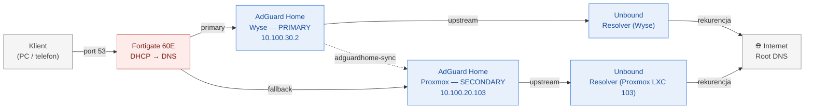

# Homelab — Network Topology (Mermaid)

## Topologia fizyczna + DNS flow + IaC pipeline

```mermaid
flowchart TD
    %% ── INTERNET / WAN ──────────────────────────────────
    INET["🌐 Internet\nISP / Vodafone WAN1"]
    ISP_RT["📦 Router ISP\nDouble NAT"]

    INET --> ISP_RT

    %% ── CLOUDFLARE ───────────────────────────────────────
    CF["☁️ Cloudflare\ndamianzientek.de\nn8n.damianzientek.de"]

    INET -. "DNS / Proxy" .-> CF

    %% ── FIREWALL ─────────────────────────────────────────
    FGT["🛡️ Fortigate 60E\nFirewall / Router / VLAN\nP1·P2·P3·P7\nIPSec VPN (dialup)"]

    ISP_RT --> FGT

    %% ── SWITCHING ────────────────────────────────────────
    NETGEAR["🔀 Netgear GS308E\nVLAN10 · VLAN100"]
    TPLINK["🔀 TP-Link TL-SG108PE\nVLAN20 · VLAN90 · PoE"]

    FGT -- "P1\nVLAN10·100" --> NETGEAR
    FGT -- "P2\nVLAN20·90" --> TPLINK

    %% ── DELL WYSE (DNS PRIMARY + QDevice) ───────────────
    WYSE["💻 DELL Wyse 3040\nDebian 13 · Intel Atom · 2GB\nDNS_LAN 10.100.30.2\nCorosync QDevice (tie-breaker)"]
    AGH1["🛡️ AdGuard Home\nGłówna instancja\n10.100.30.2"]
    UB1["🔍 Unbound\nDNS Resolver\nGłówna inst."]
    KUMA["📊 Uptime Kuma\nNetwork Monitor\n(Docker)"]

    FGT -- "P3 Internal3\nNative Interface" --> WYSE
    WYSE --> AGH1
    WYSE --> UB1
    WYSE --> KUMA
    AGH1 -- "upstream" --> UB1

    %% ── ACCESS POINTS ────────────────────────────────────
    AP1["📡 FortiAP 231F\nIndoor · VLAN40·50·90·Guest"]
    AP2["📡 FortiAP U323EV-E\nOutdoor · VLAN40·50·90·Guest"]

    FGT -- "P7 + PoE injektor" --> AP1
    TPLINK -- "P4 PoE" --> AP2

    %% ── WORKSTATIONS ─────────────────────────────────────
    PC["🖥️ PC · Windows 11 + WSL\nTerraform · Ansible · kubectl\nVS Code · VLAN10 HOME"]
    LAPTOP["💻 Laptop · Sony Vaio\nDebian 13 · KDE Plasma 6\nWSLAN HOME"]
    SAT["📺 Dekoder SAT\nVLAN100 MEDIA"]
    PS5["🎮 PS5\nVLAN100 MEDIA"]

    NETGEAR -- "P4" --> PC
    NETGEAR -- "P5" --> SAT
    NETGEAR -- "P6" --> PS5
    AP1 -. "WiFi HOME VLAN40" .-> LAPTOP

    %% ── CAMERAS ──────────────────────────────────────────
    CAM1["📷 Reolink RLC-510A\nKamera 1 · VLAN90 IoT"]
    CAM2["📷 Reolink RLC-510A\nKamera 2 · VLAN90 IoT"]

    TPLINK -- "P1 PoE" --> CAM1
    TPLINK -- "P2 PoE" --> CAM2

    %% ── IoT / PV ─────────────────────────────────────────
    SHELLY["🔌 Shelly IoT\nPro 3EM · 1PM Mini · 1 Mini\nVLAN90"]
    PV["☀️ Balkonkraftwerk\n2× 430W + 800W mikroinwerter\nmonit. przez Shelly Pro 3EM"]

    AP1 -. "WiFi IoT VLAN90" .-> SHELLY
    AP2 -. "WiFi IoT VLAN90" .-> SHELLY
    SHELLY --> PV

    %% ── PROXMOX NODE 1 ───────────────────────────────────
    PVE1["⚙️ Proxmox VE 9 — pve1\n10.100.20.10 · i5-7400 · 16GB RAM\nAsus Prime B250M-C · 250GB SSD"]

    TPLINK -- "P7 VLAN20" --> PVE1

    %% pve1 — LXC / VM
    TAIL["🔒 Tailscale LXC 102\nSubnet Router\nZdalny dostęp"]
    AGH2["🛡️ AGH LXC 103\nInstancja 2 + Unbound\n+ adguardhome-sync"]
    NPM["🔁 NPM LXC 104\nNginx Proxy Manager\nReverse Proxy"]
    CLOUDFLARED["☁️ cloudflared LXC 105\nCF Tunnel\ndamianzientek.de · n8n.*"]
    GITEA["🐙 Gitea LXC 200\nGit Server · Alpine\nhomelab-iac · portfolio"]
    N8N["⚡ n8n LXC 201\nAutomation Platform\nDocker · Gemini · Haiku"]
    RUNNER["🏃 Gitea Runner LXC 202\nCI/CD · Docker builds\nportfolio pipeline"]
    UTILITY["📦 utility-apps LXC 300\nVaultwarden · Kavita\nActual Budget · Ntfy\nHomarr · Stirling-PDF"]
    PBS["💾 PBS LXC 900\nProxmox Backup Server 4.x"]
    HAOS["🏠 Home Assistant\nHAOS VM 101"]

    PVE1 --> TAIL
    PVE1 --> AGH2
    PVE1 --> NPM
    PVE1 --> CLOUDFLARED
    PVE1 --> GITEA
    PVE1 --> N8N
    PVE1 --> RUNNER
    PVE1 --> UTILITY
    PVE1 --> PBS
    PVE1 --> HAOS

    %% ── PROXMOX NODE 2 ───────────────────────────────────
    PVE2["⚙️ Proxmox VE 9 — pve2\n10.100.20.11 · i5-7600K · 32GB RAM\nASRock H270M Pro4 · 275GB SSD"]

    TPLINK -- "P6 VLAN20" --> PVE2

    %% pve2 — LXC / VM
    JELLYFIN["🎬 Jellyfin LXC 310\nMedia Server"]
    ARR["🎯 arr-stack LXC 311\nRadarr · Sonarr · Prowlarr\nJellyseerr · zurg · rclone"]
    FRIGATE["📷 Frigate LXC 320\nNVR · Docker\nReolink integration"]
    K3S["☸️ k3s VM 410\n10.100.20.41 · 10GB RAM\nKlaster Kubernetes"]

    PVE2 --> JELLYFIN
    PVE2 --> ARR
    PVE2 --> FRIGATE
    PVE2 --> K3S

    %% ── K3S WORKLOADS ────────────────────────────────────
    PROM["📈 Prometheus + Grafana\nMonitoring klastra"]
    PORTFOLIO["🌐 Portfolio\ndamianzientek.de\nAstro · nginx · replicas: 2"]

    K3S --> PROM
    K3S --> PORTFOLIO

    %% ── PROXMOX HA CLUSTER ───────────────────────────────
    PVE1 <-. "Corosync HA Cluster\n3 votes · quorum: 2" .-> PVE2
    WYSE -. "QDevice\ntie-breaker" .-> PVE1
    WYSE -. "QDevice\ntie-breaker" .-> PVE2

    %% ── IaC / CI/CD PIPELINE ─────────────────────────────
    PC -- "git push\nTerraform · Ansible" --> GITEA
    GITEA -- "webhook trigger" --> RUNNER
    RUNNER -- "docker build\nkubectl rollout" --> K3S

    %% ── CLOUDFLARE TUNNEL ────────────────────────────────
    CLOUDFLARED -. "CF Tunnel" .-> CF
    CF -. "damianzientek.de" .-> PORTFOLIO
    CF -. "n8n.damianzientek.de" .-> N8N

    %% ── AGH SYNC ─────────────────────────────────────────
    AGH1 -. "adguardhome-sync\n(replikacja config)" .-> AGH2

    %% ── DNS FLOW ─────────────────────────────────────────
    PC == "DNS query" ==> FGT
    FGT == "primary DNS 10.100.30.x" ==> AGH1
    AGH1 == "upstream resolver" ==> UB1
    FGT == "secondary DNS fallback" ==> AGH2
    AGH2 == "upstream resolver" ==> UB1

    %% ── HOME ASSISTANT INTEGRATIONS ──────────────────────
    HAOS -. "integracja IoT" .-> SHELLY
    FRIGATE -. "kamera feed" .-> CAM1
    FRIGATE -. "kamera feed" .-> CAM2

    %% ── STYLE ────────────────────────────────────────────
    classDef firewall  fill:#fdecea,stroke:#c0392b,color:#7a1e15
    classDef server    fill:#fff0d9,stroke:#e57e00,color:#8a4c00
    classDef dns       fill:#e8f0fb,stroke:#3b7dd8,color:#1a4f9c
    classDef iot       fill:#fef9c3,stroke:#ca8a04,color:#713f12
    classDef media     fill:#fdf8e1,stroke:#b8860b,color:#7a5800
    classDef home      fill:#e6f4ee,stroke:#2e8b57,color:#1a5c3a
    classDef vpn       fill:#e0f4f4,stroke:#0e7c7b,color:#0a4f4e
    classDef wan       fill:#f5f5f5,stroke:#888,color:#444
    classDef platform  fill:#f3e8ff,stroke:#7c3aed,color:#4c1d95
    classDef k3s       fill:#e0f2fe,stroke:#0369a1,color:#0c4a6e
    classDef cloud     fill:#dbeafe,stroke:#2563eb,color:#1e3a8a
    classDef workstation fill:#f0fdf4,stroke:#16a34a,color:#14532d

    class FGT firewall
    class PVE1,PVE2,PBS server
    class WYSE,AGH1,AGH2,UB1,KUMA dns
    class TAIL vpn
    class CAM1,CAM2,SHELLY,PV iot
    class SAT,PS5,JELLYFIN,ARR media
    class AP1,AP2 home
    class INET,ISP_RT,NETGEAR,TPLINK wan
    class GITEA,RUNNER,N8N,NPM,UTILITY,HAOS,FRIGATE platform
    class K3S,PROM,PORTFOLIO k3s
    class CLOUDFLARED,CF cloud
    class PC,LAPTOP workstation
```

---

## Tylko DNS flow (uproszczony)

```mermaid
flowchart LR
    CLIENT["Klient\n(PC / telefon)"]
    FGT["Fortigate 60E\nDHCP → DNS"]
    AGH1["AdGuard Home\nWyse — PRIMARY\n10.100.30.2"]
    AGH2["AdGuard Home\nProxmox — SECONDARY\n10.100.20.103"]
    UB1["Unbound\nResolver (Wyse)"]
    UB2["Unbound\nResolver (Proxmox LXC 103)"]
    INET["🌐 Internet\nRoot DNS"]

    CLIENT -- "port 53" --> FGT
    FGT -- "primary" --> AGH1
    FGT -- "fallback" --> AGH2
    AGH1 -- "upstream" --> UB1
    AGH2 -- "upstream" --> UB2
    UB1 -- "rekurencja" --> INET
    UB2 -- "rekurencja" --> INET
    AGH1 -. "adguardhome-sync" .-> AGH2

    classDef dns fill:#e8f0fb,stroke:#3b7dd8,color:#1a4f9c
    classDef fw  fill:#fdecea,stroke:#c0392b,color:#7a1e15
    classDef net fill:#f5f5f5,stroke:#888,color:#444

    class AGH1,AGH2,UB1,UB2 dns
    class FGT fw
    class CLIENT,INET net
```

---

## IaC / CI/CD Pipeline

```mermaid
flowchart LR
    WSL["🖥️ PC · WSL\nTerraform · Ansible\nkubectl"]
    GITEA["🐙 Gitea\ngitea.damianzientek.de\nhomelab-iac · portfolio"]
    RUNNER["🏃 Gitea Runner\nDocker-in-Docker\nCI/CD builds"]
    K3S["☸️ k3s VM\nKlaster Kubernetes\n10.100.20.41"]
    PORTFOLIO["🌐 Portfolio\ndamianzientek.de\nreplicas: 2"]
    CF["☁️ Cloudflare Tunnel\ncloudflared LXC 105"]

    WSL -- "git push\nconventional commits" --> GITEA
    GITEA -- "Actions webhook" --> RUNNER
    RUNNER -- "docker build\npush to registry\nkubectl rollout restart" --> K3S
    K3S --> PORTFOLIO
    PORTFOLIO -. "CF Tunnel" .-> CF

    classDef iac     fill:#f3e8ff,stroke:#7c3aed,color:#4c1d95
    classDef k3s     fill:#e0f2fe,stroke:#0369a1,color:#0c4a6e
    classDef cloud   fill:#dbeafe,stroke:#2563eb,color:#1e3a8a
    classDef work    fill:#f0fdf4,stroke:#16a34a,color:#14532d

    class WSL work
    class GITEA,RUNNER iac
    class K3S,PORTFOLIO k3s
    class CF cloud
```