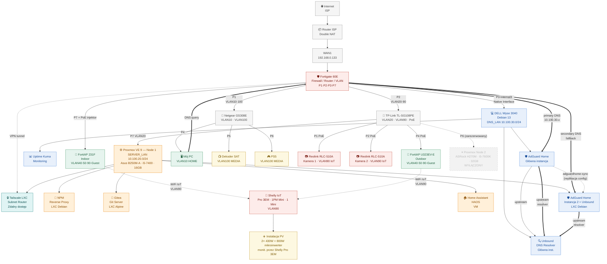
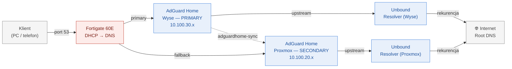

# Homelab — Network Topology (Mermaid)

Wklej poniższy kod do Gitea, Obsidiana, Notion, GitHub lub https://mermaid.live

## Topologia fizyczna + DNS flow

```mermaid
flowchart TD
    %% ── INTERNET / WAN ──────────────────────────────────
    INET["🌐 Internet\nISP"]
    ISP_RT["📦 Router ISP\nDouble NAT"]
    WAN1["WAN1\n192.168.0.133"]

    INET --> ISP_RT --> WAN1

    %% ── FIREWALL ─────────────────────────────────────────
    FGT["🛡️ Fortigate 60E\nFirewall / Router / VLAN\nP1·P2·P3·P7"]

    WAN1 --> FGT

    %% ── TAILSCALE (VPN) ──────────────────────────────────
    TAIL["🔒 Tailscale LXC\nSubnet Router\nZdalny dostęp"]

    FGT -. "VPN tunnel" .-> TAIL

    %% ── SWITCHING ────────────────────────────────────────
    NETGEAR["🔀 Netgear GS308E\nVLAN10 · VLAN100"]
    TPLINK["🔀 TP-Link TL-SG108PE\nVLAN20 · VLAN90 · PoE"]

    FGT -- "P1\nVLAN10·100" --> NETGEAR
    FGT -- "P2\nVLAN20·90" --> TPLINK

    %% ── DELL WYSE (DNS PRIMARY) ──────────────────────────
    WYSE["💻 DELL Wyse 3040\nDebian 13\nDNS_LAN 10.100.30.0/24"]
    AGH1["🛡️ AdGuard Home\nGłówna instancja"]
    UB1["🔍 Unbound\nDNS Resolver\nGłówna inst."]
    KUMA["📊 Uptime Kuma\nMonitoring"]

    FGT -- "P3 Internal3\nNative Interface" --> WYSE
    WYSE --> AGH1
    WYSE --> UB1
    WYSE --> KUMA
    AGH1 -- "upstream" --> UB1

    %% ── ACCESS POINTS ────────────────────────────────────
    AP1["📡 FortiAP 231F\nIndoor\nVLAN40·50·90·Guest"]
    AP2["📡 FortiAP U323EV-E\nOutdoor\nVLAN40·50·90·Guest"]

    FGT -- "P7 + PoE injektor" --> AP1
    TPLINK -- "P4 PoE" --> AP2

    %% ── DEVICES via Netgear ──────────────────────────────
    PC["🖥️ Mój PC\nVLAN10 HOME"]
    SAT["📺 Dekoder SAT\nVLAN100 MEDIA"]
    PS5["🎮 PS5\nVLAN100 MEDIA"]

    NETGEAR -- "P4" --> PC
    NETGEAR -- "P5" --> SAT
    NETGEAR -- "P6" --> PS5

    %% ── DEVICES via TP-Link ──────────────────────────────
    CAM1["📷 Reolink RLC-510A\nKamera 1 · VLAN90 IoT"]
    CAM2["📷 Reolink RLC-510A\nKamera 2 · VLAN90 IoT"]

    TPLINK -- "P1 PoE" --> CAM1
    TPLINK -- "P2 PoE" --> CAM2

    %% ── PROXMOX NODE 1 ───────────────────────────────────
    PVE["⚙️ Proxmox VE 9 — Node 1\nSERVER_LAN 10.100.20.0/24\nAsus B250M-A · i5-7400 · 16GB"]
    NPM["🔁 NPM\nReverse Proxy\nLXC Debian"]
    GITEA["🐙 Gitea\nGit Server\nLXC Alpine"]
    AGH2["🛡️ AdGuard Home\nInstancja 2 + Unbound\nLXC Debian"]
    HAOS["🏠 Home Assistant\nHAOS\nVM"]

    TPLINK -- "P7 VLAN20" --> PVE
    PVE --> TAIL
    PVE --> NPM
    PVE --> GITEA
    PVE --> AGH2
    PVE --> HAOS

    %% ── NODE 2 (OFF) ─────────────────────────────────────
    NODE2["⏸ Proxmox Node 2\nASRock H270M · i5-7600K · 32GB\nWYŁĄCZONY"]

    TPLINK -. "P6 (zarezerwowany)" .-> NODE2

    %% ── IoT / PV ─────────────────────────────────────────
    SHELLY["🔌 Shelly IoT\nPro 3EM · 1PM Mini · 1 Mini\nVLAN90"]
    PV["☀️ Instalacja PV\n2× 430W + 800W mikroinwerter\nmonit. przez Shelly Pro 3EM"]

    AP1 -. "WiFi IoT\nVLAN90" .-> SHELLY
    AP2 -. "WiFi IoT\nVLAN90" .-> SHELLY
    SHELLY --> PV

    %% ── DNS FLOW ─────────────────────────────────────────
    PC == "DNS query" ==> FGT
    FGT == "primary DNS\n10.100.30.x" ==> AGH1
    AGH1 == "upstream\nresolver" ==> UB1
    FGT == "secondary DNS\nfallback" ==> AGH2
    AGH2 == "upstream\nresolver" ==> UB1
    AGH1 -. "adguardhome-sync\n(replikacja config)" .-> AGH2

    %% ── STYLE ────────────────────────────────────────────
    classDef firewall fill:#fdecea,stroke:#c0392b,color:#7a1e15
    classDef server fill:#fff0d9,stroke:#e57e00,color:#8a4c00
    classDef dns fill:#e8f0fb,stroke:#3b7dd8,color:#1a4f9c
    classDef iot fill:#fdecea,stroke:#c0392b,color:#7a1e15
    classDef media fill:#fdf8e1,stroke:#b8860b,color:#7a5800
    classDef home fill:#e6f4ee,stroke:#2e8b57,color:#1a5c3a
    classDef vpn fill:#e0f4f4,stroke:#0e7c7b,color:#0a4f4e
    classDef wan fill:#f5f5f5,stroke:#888,color:#444
    classDef off fill:#f2f2f2,stroke:#bbb,color:#bbb,stroke-dasharray:5 5

    class FGT firewall
    class PVE,NPM,GITEA,HAOS server
    class WYSE,AGH1,AGH2,UB1,KUMA dns
    class TAIL vpn
    class CAM1,CAM2,SHELLY iot
    class SAT,PS5,PV media
    class PC,AP1,AP2 home
    class INET,ISP_RT,WAN1,NETGEAR,TPLINK wan
    class NODE2 off
```

---

## Tylko DNS flow (uproszczony)

```mermaid
flowchart LR
    CLIENT["Klient\n(PC / telefon)"]
    FGT["Fortigate 60E\nDHCP → DNS"]
    AGH1["AdGuard Home\nWyse — PRIMARY\n10.100.30.x"]
    AGH2["AdGuard Home\nProxmox — SECONDARY\n10.100.20.x"]
    UB1["Unbound\nResolver (Wyse)"]
    UB2["Unbound\nResolver (Proxmox)"]
    INET["🌐 Internet\nRoot DNS"]

    CLIENT -- "port 53" --> FGT
    FGT -- "primary" --> AGH1
    FGT -- "fallback" --> AGH2
    AGH1 -- "upstream" --> UB1
    AGH2 -- "upstream" --> UB2
    UB1 -- "rekurencja" --> INET
    UB2 -- "rekurencja" --> INET
    AGH1 -. "adguardhome-sync" .-> AGH2

    classDef dns fill:#e8f0fb,stroke:#3b7dd8,color:#1a4f9c
    classDef fw fill:#fdecea,stroke:#c0392b,color:#7a1e15
    classDef net fill:#f5f5f5,stroke:#888,color:#444

    class AGH1,AGH2,UB1,UB2 dns
    class FGT fw
    class CLIENT,INET net
```